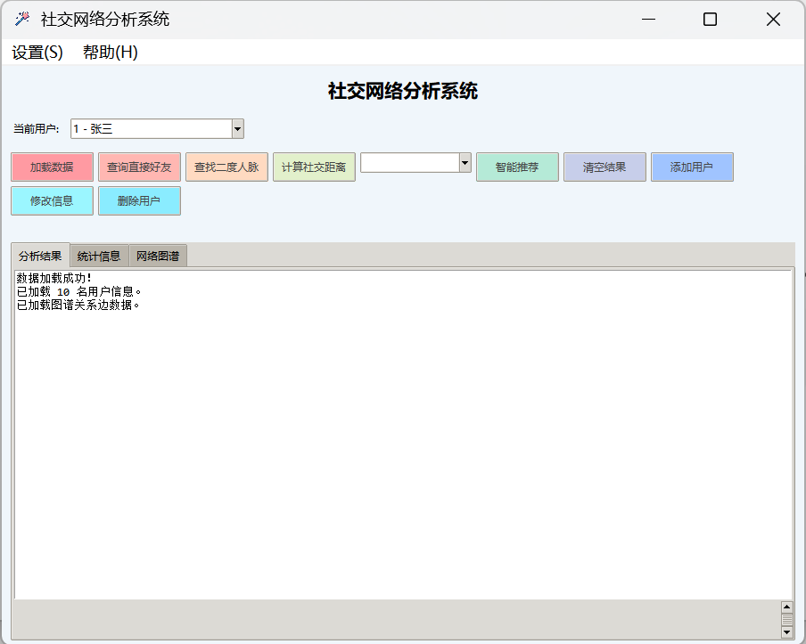
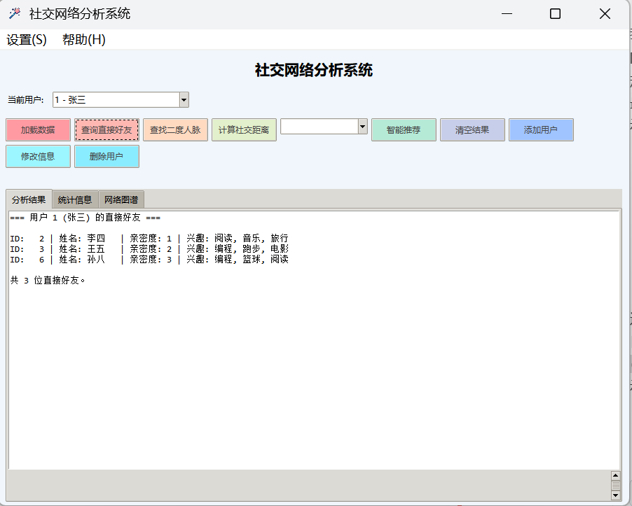
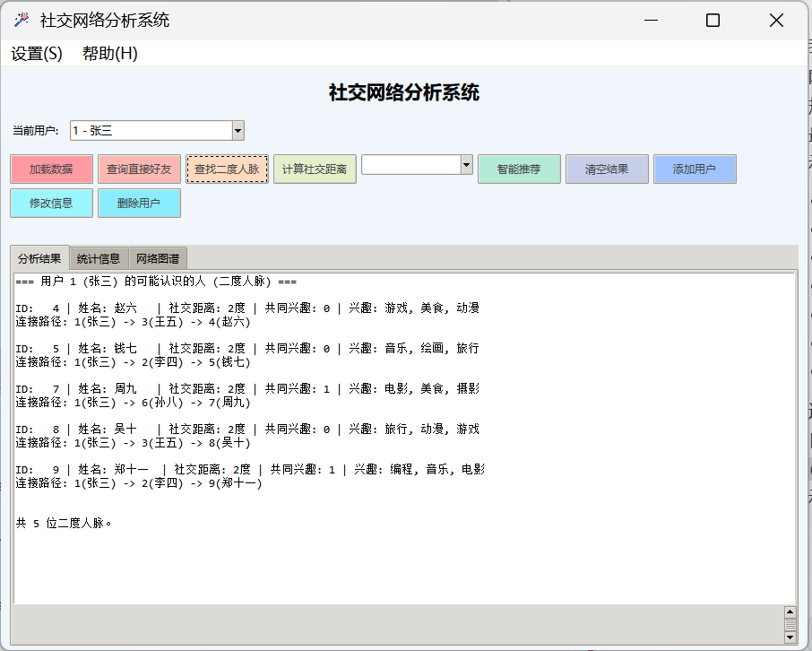
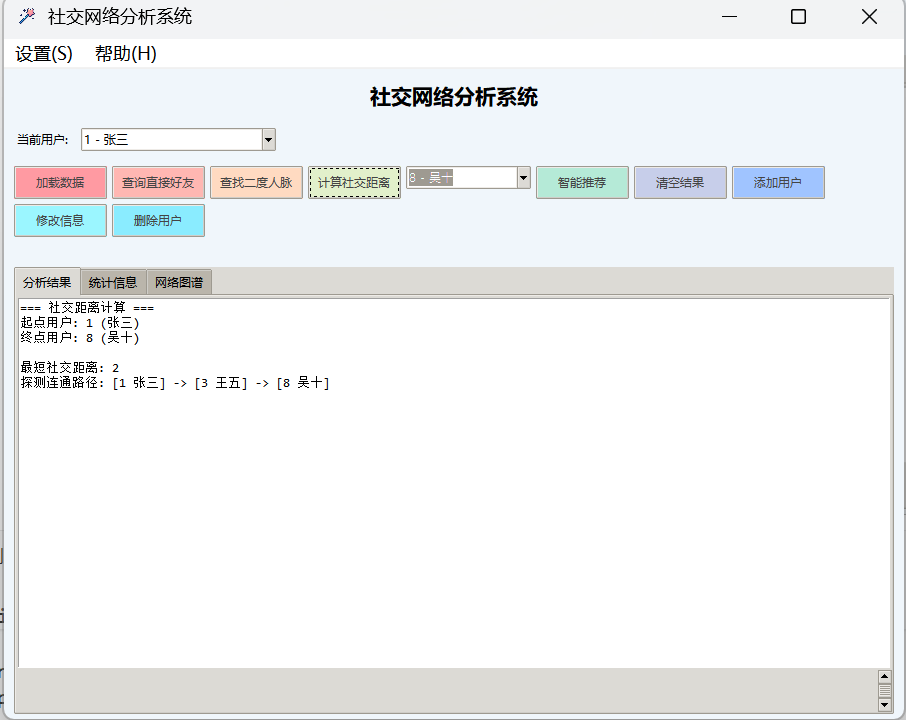
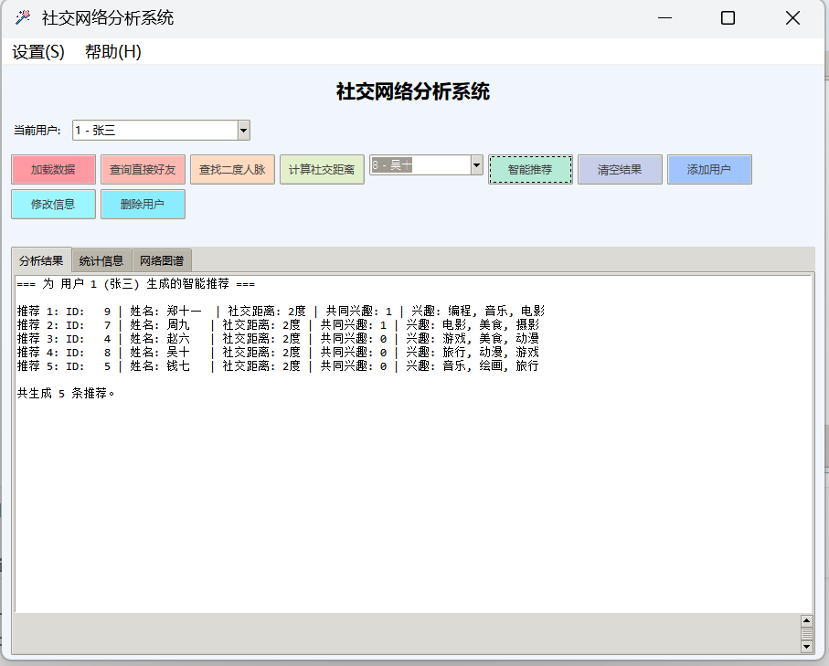
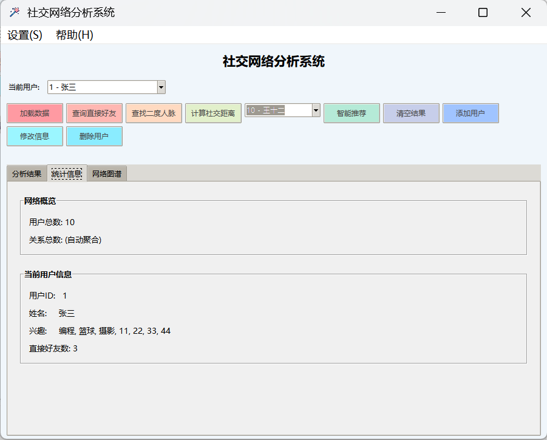
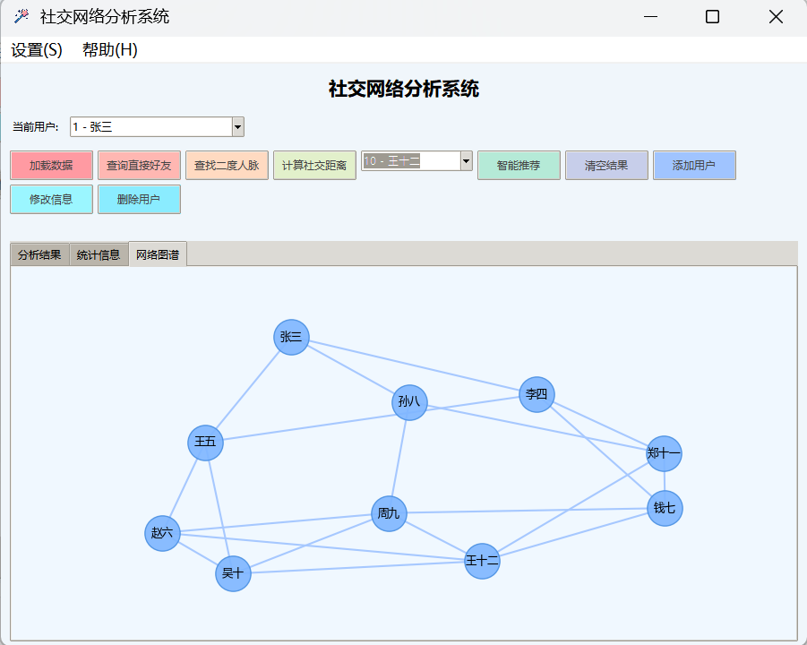
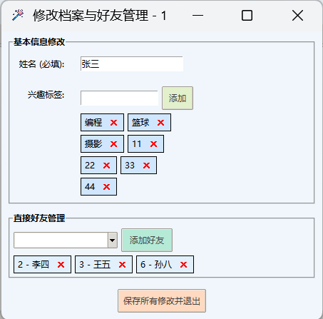

# 社交网络图谱分析及智能推荐系统

## 项目概述

本项目为数据结构课程设计作品，基于图、哈希表、最小堆等**完全自主实现**的数据结构，开发了社交网络图谱分析及智能推荐系统。
支持一度/二度人脉查询、社交距离计算、基于兴趣标签的 Top-K 智能推荐等核心功能，旨在掌握数据结构底层原理与系统开发流程。

**项目成员**：

- **组员A**：负责底层连通图结构、搜索算法、系统主界面封装与前后端架构联调。
- **组员B**：参与部分 UI 拓展、社交距离反馈逻辑及控制台信息呈现。
- **组员C**：负责模糊搜索增强、界面组件解耦与测试数据的集成处理。

- **开发语言**：Python 3.8+
- **图形系统**：Tkinter 原生库（零依赖）

## 环境配置

### 运行环境

- Python 3.7 或更高版本

### 依赖库/组件

系统核心数据结构（如图、哈希表、最小堆等算子）皆基于第一性原理纯原生构建。
为支持前端复杂的**网络图谱可视化**特征，界面端额外引入了如下视觉渲染依赖：

- `networkx` 与 `matplotlib`

你可以通过一键指令完成环境组装：

```bash
git clone https://github.com/ywtiny/Social-Network-System.git
cd Social-Network-System
pip install -r requirements.txt
```

## 文件结构

```text
Social-Network-System/
├─ assets/                # 资源文件
│  ├─ icons/              # 程序图标
│  └─ screenshots/        # 演示图片
├─ data/                  # 测试数据文件
│  ├─ user_sample.csv     # 用户信息数据（带兴趣标签）
│  └─ friend_sample.txt   # 好友关系数据
├─ src/                   # 源代码目录
│  ├─ data_structure/     # 自主实现的数据结构
│  │  ├─ adjacency_list.py  # 邻接表
│  │  ├─ hash_table.py      # 哈希表
│  │  └─ heap.py            # 最小堆（扩展功能用： Top-K 推荐）
│  ├─ algorithm/          # 核心算法
│  │  └─ algorithms.py      # BFS算法及智能推荐模块
│  ├─ utils/              # 工具类
│  │  └─ data_reader.py     # 数据读取（CSV/TXT解析）
│  └─ main.py             # 程序入口及 Tkinter GUI 界面
└─ README.md              # 本说明文档
```

## 运行步骤

1. 确保系统包含 Python 3 基础环境（支持系统级 `Tkinter` 窗口模块）。
2. 打开任意终端或 PowerShell，定位到项目根目录。
3. 挂载安装项目的前端依赖项：

```bash
pip install -r requirements.txt
```

1. 运行应用主引擎：

```bash
python src/main.py
```

1. 图形界面弹出后，系统将自动注入测试数据集，随后即可完成所有的图谱探测、二度推导及画卷预览。
2. 若需切换数据集，可点击主界面按钮 `加载数据`，手动选择用户文件（CSV/TXT）与关系文件（TXT/CSV）后实时重载。

## 数据格式说明

系统支持从CSV/TXT文件自动加载数据。

- **用户信息（user_sample.csv）**

```text
用户ID,姓名,兴趣标签
1,张三,编程;篮球;摄影
...
```

- **好友关系（friend_sample.txt）**

```text
1,2
3,4
...
```

## 功能说明

### 核心功能

1. **图结构建模**：基于字典与列表自主实现无向图邻接表，支持节点与边的新增、删除、查询（如 `add/remove/has`）。
2. **数据持久化**：使用文件流加载 CSV/TXT 格式的用户信息及好友关系数据。
3. **哈希表用户信息管理**：自研采用**链地址法**解决冲突的哈希表，并对用户数据提供 O(1) 级别查找。
4. **一度人脉查询**：利用邻接表秒级返回用户的直接好友网络。
5. **二度人脉发现**：基于 BFS 搜索逻辑，精准排除自回环及一度网络，输出干净的二度人脉圈，并展示“目标→一度好友→二度人脉”连接路径。
6. **社交距离计算**：通过 BFS 层序探测算法计算社交网络的节点最小跨越距离及最短路径链。
7. **GUI 集成界面**：具备数据加载入口、输入校验、防崩溃设计、多状态展示弹窗的完整主窗口工程。

### 智能组件

1. **Top-K 个性化好友推荐**
   - 依赖项：自研包含 `sift_up` 与 `sift_down` 调整策略的**定长最小堆 (MinHeap)** 数据结构。
   - 实现逻辑：融合计算两名用户间的 **兴趣交并比 (Jaccard Similarity)** 以及 **共同好友覆盖率** 两项图谱特征参数，赋予最终推荐得分。
   - 使用最小堆不断筛选过滤低维连接，精确维护指定阈值（例如 Top-3）内匹配度最高的潜在结交好友推荐。

## 开发过程

本项目严格遵循从底层逻辑到上层 UI 的增量式敏捷开发，核心里程碑记录如下：

- [x] **2026-02-18** `feat/init`: 完成图基础结构和BFS算法编写，实现一度/二度人脉查找及社交距离测算基础能力。
- [x] **2026-02-19** `feat`: 引入智能推荐功能，初步完成核心逻辑闭环；实装基于 `networkx` 的可视化网络图谱并优化前端排版。
- [x] **2026-02-20** `feat`: 彻底跑通“添加/修改/删除用户”模块，实现内存数据与本地持久化文件（CSV/TXT）的双向绑定。
- [x] **2026-02-21** `ui`: 引入自适应流式布局 (`FlowFrame`) 与可交互的纸片标签 (`InterestPanel`)，解决长文本与多选截断痛点。
- [x] **2026-02-22** `refactor`: 大幅重构全平台人员搜索框，自主研发 `FriendPanel`，实现全域无缝拼音联想过滤，并修复系列恶性 Bug。系统最终完全体定稿。

## 注意事项

1. **防止文件读取失效**：程序采用了 `__file__` 相对到绝对路径的动态追溯装载，故无论您在哪一层级按何种指令启动进程，系统都能成功寻找挂载点，不用担心相对执行路径导致白屏瘫痪。
2. **性能反馈**：本方案在实现底层图与哈希缓存时均控制了时间复杂度，未产生大嵌套死循环问题。
3. **技术边界说明**：针对业务需求，最短路径、BFS算法引擎及推荐栈皆遵循原生算法手写； `NetworkX` 组合包仅在 `Tab: 网络图谱` 的视觉模块使用纯坐标系绘制布局功能，未越权参与底层图谱计算。

## 系统功能演示

以下是各核心功能模块的系统独立运行界面切片预览：

### 01. 系统主引擎展示



### 02. 人物搜索与关联网度探索






### 03. 智能推荐分析引擎



### 04. 可视化分析报告




### 05. 后台人员档案交互与支持





